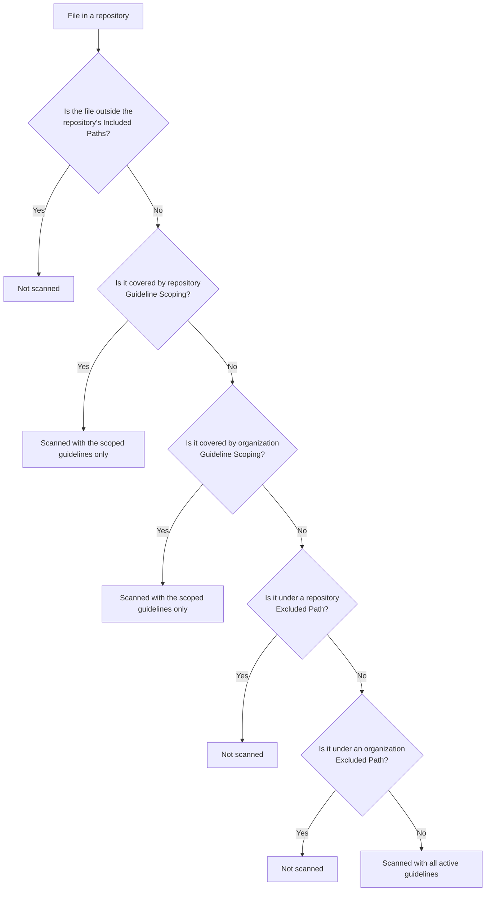

Pandorian helps engineering teams turn their standards into enforceable rules across repositories and pull requests. This guide covers the main workflows for managing guidelines, scoping where they apply, enforcing them in scans and pull requests, and onboarding your team.

## Manage

Use these workflows to create, import, organize, and enrich the guidelines that Pandorian enforces.

### Creating a Guideline from Scratch

Create a custom guideline when you want Pandorian to enforce a rule that is specific to your engineering organization, architecture, frameworks, internal libraries, or coding standards.

To create a guideline:

1. Navigate to the **Guidelines** page.
2. Click **+ New Guideline**.
3. Select **Guideline**.
4. Fill in the required fields.
5. Click **Save changes**.

A guideline includes the rule Pandorian should enforce, the language or languages it applies to, and the enforcement behavior.

Required fields include:

- **Guideline ID:** A unique, manually defined identifier for the guideline.
- **Title:** A clear name for the rule.
- **Description:** The actual instruction Pandorian should enforce.
- **Category:** The engineering area this guideline belongs to.
- **Language:** One or more languages this guideline applies to.
- **Blocked mode:** Whether the guideline runs in Monitor mode or blocks the build.
- **Active or inactive:** Whether the guideline is currently enforced.

Supported categories include:

- Architecture
- Code Quality and Maintainability
- Data and Storage
- Infrastructure and Environments
- Observability
- Performance and Scalability
- Reliability and Resilience
- Security

Guideline tags are optional. You can choose an existing tag or create a new one while creating the guideline. Tags help organize guidelines and can later be used in scan policies to control where groups of guidelines run.

Scoping is not managed directly from the guideline creation form. Use **Scan Policies** to decide where tagged guidelines should run across repositories and paths.

#### Writing a strong guideline

A good guideline is specific, enforceable, and written in a way that Pandorian can evaluate against code.

Strong guidelines usually include:

- The rule the code must follow.
- The reason the rule exists.
- Examples of compliant or non-compliant patterns.
- Any important exceptions.
- Language, framework, or architecture context.

Good example:

> All database credentials must be loaded from environment variables or a secrets manager. Do not hardcode usernames, passwords, tokens, or connection strings directly in source code.

This guideline is enforceable because it names the risky pattern, describes the expected behavior, and gives Pandorian enough context to identify violations.

Weak example:

> Write secure code.

This guideline is too broad. It does not explain what secure code means, which patterns should be rejected, or what compliant code should look like.

For deeper guidance on authoring enforceable guidelines, see [Authoring Enforceable Guidelines](https://pandorian.ai/research/authoring-enforceable-guidelines/).

#### Testing a new guideline

After creating a guideline, test it with a PR scan when possible. PR scans are usually the best way to validate a new guideline because they focus on changed code and give you faster feedback.

You can also run a full repository scan, but full scans may be limited depending on your plan and should be used more selectively.

A recommended rollout is:

1. Create the guideline.
2. Start in **Monitor only** mode.
3. Run it against a PR.
4. Review the violations.
5. Refine the guideline if needed.
6. Move to **Block Build** only after you trust the results.

---

### Importing Guidelines from Confluence or Markdown

Use imports when your engineering standards already exist in another place, such as Confluence pages or Markdown files used by engineering teams or AI coding agents.

To import guidelines:

1. Navigate to the **Guidelines** page.
2. Click **+ New Guideline**.
3. Choose one of the import options:
   - **from Confluence**
   - **from File**
   - **from Catalog**

Pandorian extracts the source text and returns editable guidelines for review. Imported guidelines are not active by default, so you can inspect and edit them before enabling enforcement.

#### Importing from Confluence

Use the Confluence import when your engineering standards live in Confluence.

The flow is:

1. Connect your Confluence workspace.
2. Choose a Confluence space.
3. Select the page you want to import.
4. Let Pandorian extract potential guidelines from the page.
5. Review and edit the extracted guidelines.
6. Save the guidelines you want to use.

Pandorian does not preserve Confluence page hierarchy as part of the guideline structure. The imported content is converted into editable guidelines that can be reviewed one by one.

#### Importing from Markdown

Use Markdown import when you have standards written in `.md` files.

The flow is:

1. Click **+ New Guideline** from the Guidelines page.
2. Select **from File**.
3. Upload a `.md` file.
4. Review the guidelines Pandorian extracts.
5. Edit and save the guidelines you want to use.

Pandorian supports one Markdown file per upload. Imported guidelines are reviewed one by one before activation.

This is also useful for Markdown files used by AI agents or coding assistant skill systems. If your agent skills are stored as `.md` files, you can upload those files to Pandorian and turn the same instructions into enforceable guidelines.

#### When to use Guidelines as Code instead

Use **Guidelines as Code** when your team wants to manage guidelines directly from Git and review guideline changes through pull requests.

---

### Guidelines as Code

Guidelines as Code lets teams manage Pandorian guidelines from Markdown files in Git.

This is useful when engineering standards should be versioned, reviewed, and updated through the same workflow as code. Teams can use this to keep internal Markdown guidelines or AI coding assistant skill files aligned with the rules Pandorian enforces.

Guidelines as Code is configured through the source control integration.

For setup details, see [Guidelines as Code](/essentials/pandorian-integrations#guidelines-as-code).

---

### Using the Guidelines Catalog

The Guidelines Catalog gives you a starting point for common engineering standards across supported languages and categories.

To import a catalog guideline:

1. Navigate to the **Guidelines** page.
2. Click **+ New Guideline**.
3. Select **from Catalog**.
4. Browse or search for a guideline.
5. Import the guideline into your organization.
6. Choose its enforcement mode.
7. Add tags if you want to use it with scan policies.

You can browse the catalog by language and category, or search by keyword.

The in-product catalog is the same catalog available at [pandorian.ai/catalog](https://pandorian.ai/catalog).

When you import a catalog guideline, it becomes a guideline in your organization. It does not remain linked to the public catalog. You can configure how it should behave in your environment, including whether it should run in Monitor mode or Block Build mode.

Catalog guidelines cannot be scoped directly from the catalog itself. To scope them, add useful tags and then use Scan Policies to decide where those tagged guidelines should run.

---

### Dynamic Context Providers

Some guidelines need live context, not just static text.

Dynamic Context Providers let guidelines evaluate code against real-time data, such as approved libraries, internal API routes, active feature flags, or configuration flags.

A provider can be configured with:

- **Title**
- **Command**
- **Grep**
- **Timeout**

Use Dynamic Context Providers when a guideline depends on information that may change over time.

For setup details, see [Dynamic Context Providers](/essentials/pandorian-integrations#dynamic-context-providers).

---

### Scan Policies

Scan Policies let you define exactly which files Pandorian scans, which guidelines apply to them, and which files are excluded. These settings exist at both the repository and organization level, and are evaluated in a fixed order — the first one that applies to a file decides its outcome.

Navigate to **Scan Policies** in the Pandorian dashboard to configure.

#### Evaluation order

For a file in a repository, Pandorian checks the following in order. As soon as one applies, evaluation stops for that file:

1. **Repository Included Paths** — If the repository has Included Paths configured and the file falls outside them, the file is not scanned.
2. **Repository-level Guideline Scoping** — If the file is covered by Guideline Scoping configured on this repository, it's scanned with only the guidelines scoped to that path.
3. **Organization-level Guideline Scoping** — If the file is covered by Guideline Scoping configured at the organization level, it's scanned with only the guidelines scoped to that path.
4. **Repository Excluded Paths** — If the file falls under an excluded path configured on this repository, it is not scanned.
5. **Organization Excluded Paths** — If the file falls under an excluded path configured at the organization level, it is not scanned.
6. **Default** — If none of the above apply, the file is scanned against every active guideline.

> **Note:** Included Paths only exists as a repository-level setting. There's no organization-wide Included Paths gate — organization-wide inclusion is expressed through Guideline Scoping (step 3), not through a separate allowlist.
>
> Because Guideline Scoping (steps 2–3) is checked before Excluded Paths (steps 4–5), a file covered by Guideline Scoping is scanned even if it would otherwise fall under an excluded path — the Excluded Paths check is never reached for that file. If a path needs to be excluded no matter what, use Repository Included Paths (step 1); it's the only check nothing later can override.

#### Path evaluation order at a glance

#### Organization Policy

Organization-level policy applies across all repositories by default, and is checked after any repository-level settings.

**Guideline Scoping:** Restrict a guideline group to specific paths across the organization. Rather than running all guidelines across the entire codebase, Guideline Scoping lets you target enforcement by tag — for example, applying security guidelines only to the auth service, or data guidelines only to migration files. Click **Add scoping** to configure.

**Excluded Paths:** Paths that should never be scanned, applied org-wide — for files not already covered by Guideline Scoping. Use this to exclude vendor code, generated files, test fixtures, or any directory that shouldn't be subject to enforcement. Click **Exclude a path** to add an exclusion.

#### Repository Overrides

Repository overrides customize scan policy for a specific repository. Every repository-level setting is checked before its organization-level counterpart, so it takes precedence. Click **Add repository override** to configure.

**Included Paths:** The paths Pandorian scans for this repository. If set, any file outside these paths is never scanned for this repo — this is the very first check Pandorian runs, and nothing later in the evaluation order can override it. Setting Included Paths also reduces scan time, since Pandorian only analyzes those paths instead of the entire repository. If no Included Paths are set for a repository, its full contents are eligible for scanning, subject to the rest of the evaluation order.

**Guideline Scoping:** The same scoping mechanism as the organization level, but scoped to this repository only, and checked before organization-level Guideline Scoping.

**Excluded Paths:** The same exclusion mechanism as the organization level, but scoped to this repository only, and checked before organization-level Excluded Paths — and, like all Excluded Paths, only reached if the file isn't already covered by Guideline Scoping.

#### Examples

**Limiting a noisy repo's scan surface:**
A repository contains generated code alongside application code. Set that repository's Included Paths to `/src` so nothing outside it is ever scanned — cutting scan time and noise regardless of any other setting.

**Scoping compliance guidelines to sensitive services, org-wide:**
Your organization has a set of guidelines tagged `pci-compliance`. Use organization-level Guideline Scoping to restrict them to repos or paths containing payment processing code. Every other repo is unaffected, and matching files are scanned with just those guidelines.

**Scoping security guidelines to one repo's auth layer:**
Security guidelines tagged `auth` should only apply to `/src/auth` in a single repository, not organization-wide. Use repository-level Guideline Scoping instead of organization-level — it's checked first and won't affect any other repo.

**Guideline Scoping reaching a file you meant to exclude:**
Your organization excludes `**/generated/**` org-wide. Repository-level Guideline Scoping applies `code-quality` guidelines to everything under `/src`, and `/src/generated` happens to fall inside that path. Because Guideline Scoping is checked before Excluded Paths, files in `/src/generated` are scanned with the `code-quality` guidelines — the org-wide exclusion is never reached for them. To exclude `/src/generated` no matter what, keep it outside that repository's Included Paths instead.

**Overriding org defaults for a legacy repository:**
Your org-wide policy excludes test files. A legacy repo requires the opposite — tests are the only place certain patterns are enforced. Add a repository-level Excluded Paths override for that repo's non-test files, without affecting the rest of the organization.

---

### Initiatives
 
Initiatives group any guidelines and any repos you choose under a program you define — whether that's OWASP Top 10, SOC 2 Type II, an internal architecture standard, or a goal specific to your org. There is no fixed list of programs Pandorian ships with. Each Initiative shows a live compliance percentage that updates as scans run.
 
An Initiative is a named container, not a preset compliance template. If your org can describe something as "these guidelines, on these repos," it can be an Initiative — a migration, a security push, a performance commitment, or a standard one team is rolling out to the rest of the org.
 
**Pick the guidelines.** Guidelines attached to an Initiative can come from the catalog, your own imported standards, or anything written from scratch. The Initiative only needs to know which guidelines count toward this specific program.
 
**Attach the repos.** Attach only the repositories the program actually applies to. A SOC 2 Initiative might only need the services that touch customer data; a performance Initiative might need whatever is user-facing and latency-sensitive. A repository can belong to more than one Initiative at once, since a single service can fall under OWASP Top 10, SOC 2, and an internal API standard simultaneously.
 
**Track one live percentage.** Every Initiative shows a compliance percentage calculated from its own attached guidelines and repos, refreshed as scans run. This gives leadership a number they can check without pinging teams for a status update — for a compliance audit, a migration, or any other program.
 
#### Initiatives vs. tags
 
A tag (or category like Security) groups guidelines by type. An Initiative groups a specific subset of guidelines and repos into one trackable unit with its own score, regardless of category. Use tags to organize and scope guidelines; use Initiatives to measure progress against a defined program.
 
---

### Policy as Code

Policy as Code lets you configure repository-level settings as code, so Pandorian knows which guidelines to run and when to block pull requests without managing these rules outside the codebase.

A Pandorian policy is defined in a `.Pandorian/.policy` file inside the repository and applies to both full repository scans and PR scans.

Policy as Code can define:

- Which guideline tags apply to the repository.
- Which files or directories should be excluded from scans.
- Which guideline tags should apply only to specific paths.

For setup details, see [Policy as Code](/essentials/pandorian-integrations#policy-as-code).

---

## Enforce

Use these workflows to run scans, review violations, and enforce guidelines in pull requests.

### Running a Repository Scan

Pandorian supports three scan types:

- **Full repository scans**
- **Targeted scans**
- **PR scans**

A full repository scan analyzes the entire repository against selected guidelines. A targeted scan analyzes a single path in the repository, so it finishes faster and is ideal for quickly validating a guideline. A PR scan analyzes the code changes in a pull request.

Use PR scans when you want fast feedback on new changes. Use targeted scans when you want to validate a guideline against a specific area without scanning everything. Use full repository scans when you want to understand guideline compliance across a whole repository.

#### Running a full repository scan

To run a full repository scan:

1. Navigate to the **Repositories** page.
2. Select the repository you want to scan.
3. Click the play button.
4. Choose the guideline you want to scan against.
5. Start the scan.

Full repository scans analyze the repository while respecting configured scan policies, ignored paths, and repository overrides.

#### Running a targeted scan

A targeted scan runs against a single path in your repository instead of the whole thing. It's the quickest way to validate a guideline — confirm it behaves as expected on the code you care about without waiting for a full repository scan. Full repository scans remain available whenever you need complete coverage.

Use a targeted scan when you want to:

- Validate a new or edited guideline against a specific area of the codebase before rolling it out more widely.
- Re-check a single service or directory after a fix, without re-scanning everything.
- Iterate quickly, since a targeted scan only analyzes the path you select.

To run a targeted scan:

1. Navigate to the **Scans** page.
2. Click the button next to your repository.
3. Select the guideline and the path you want to scan.
4. Start the scan.

The scan runs only against the path you chose and reports violations for the selected guideline, so results come back quickly.

#### Running a PR scan

PR scans run automatically after source control is connected.

A PR scan is triggered when:

- A new pull request is opened.
- A developer pushes updates to an existing pull request.
- A pull request is reopened.

PR scans analyze the changes in the pull request and respect configured scan policies.

#### Reviewing scan results

Scan results show:

- Repository
- Scan ID
- Violations count
- Duration
- Status
- Guidelines checked

When a scan includes violations, click into the result to see where the violations were found and which lines were affected.

To run the scan again, click **Re-scan**.

---

### Viewing Violations from the Scans Page or Guidelines Page

Pandorian gives you two main ways to view violations: from the **Scans** page or from the **Guidelines** page.

Use the Scans page when you want to review the result of a specific scan.

Use the Guidelines page when you want to understand all violations related to a specific guideline.

#### Viewing violations from the Scans page

The **Scans** page is best for reviewing scan-level results.

Each scan shows information such as:

- Started At
- Scan ID
- Violations
- Duration
- Status
- Repository
- Pull request, when relevant

Open a scan to see whether it has violations and where those violations were found.

You can filter scans by:

- Scan type
- PR status
- Date range
- Repository
- With violations
- Without violations

Supported PR statuses include:

- Opened
- Merged
- Closed

Use these filters to focus on the scans that matter most, such as recent PR scans with violations or merged PRs that introduced guideline violations.

#### Viewing violations from the Guidelines page

The **Guidelines** page is best for understanding violations by guideline.

From the Guidelines page, open a guideline or click its violation badge to see violations related to that rule across scans.

This view is useful when you want to understand how widespread a guideline violation is, which repositories are affected, or whether a guideline is ready to move from Monitor mode to Block Build mode.

---

### Setting Up PR Enforcement as a CI Check

Pandorian integrates with source control so guidelines can be enforced directly in pull requests.

Supported source control providers include:

- GitHub
- GitLab
- Azure DevOps

Bitbucket is not currently supported.

After source control is connected, PR scanning runs automatically when a pull request is opened, updated, or reopened.

Pandorian can add inline comments on pull requests to show where violations were found.

#### Monitor mode

Monitor mode reports violations without blocking the build.

Use Monitor mode when introducing new guidelines, testing guideline quality, or rolling Pandorian out gradually across teams.

In Monitor mode, developers and engineering leaders can see violations, but the build is not blocked.

#### Block Build mode

Block Build mode blocks the build when violations are found.

Use Block Build mode only after you have validated the guideline and trust the results.

A recommended rollout is:

1. Start in Monitor mode.
2. Review real violations over time.
3. Refine the guideline if needed.
4. Move to Block Build mode when the team is confident in the rule.

#### Skipping a CI check

For a specific scan, you can skip the CI check from the Scans page.

Click **Skip CI Check** to skip blocking behavior for that scan. The scan still runs, but the CI check is skipped for that specific PR.

---

### Reading Violation Reports

Violation reports show where code does not comply with a guideline and what the developer can do next.

A violation report can include:

- Guideline title
- Repository
- File path
- Line number
- Code snippet
- Explanation
- Fix suggestion

Pandorian does not show severity in the violation report. Confidence is handled internally.

#### Viewing the affected code

Click **View Code** to inspect the relevant code around the violation.

Use this when you want to understand the exact context before taking action.

#### Generating a fix

Click **Generate Fix** to create remediation instructions.

Generate Fix produces Markdown instructions that can be copied into an AI coding agent or used by a developer. The Markdown includes code suggestions, but it does not automatically create a patch or pull request.

#### Archiving a violation

Click **Archive Violation** when a finding is no longer relevant.

Archived violations are excluded from future Jira ticket creation and reporting views.

Use archive for findings that are accepted, irrelevant, or no longer useful to track.

#### Creating Jira issues

If Jira is connected, Pandorian can create Jira issues from guideline violations.

From the **Guidelines** page, click the violation badge on a guideline, then click **Create Issue**. Pandorian generates a ticket draft containing all current open violations for that guideline in bulk.

Before creating a Jira ticket, archive irrelevant violations so they are not included in the generated issue.

For Jira setup details, see [Jira Integration](/essentials/pandorian-integrations#jira-integration).

---

## Analyze

Use these workflows to see guideline coverage and violation trends across your organization at a glance.

### Analytics Dashboard

Navigate to **Home** in the Pandorian dashboard for an organization-wide view of enforcement health, without digging into individual scans or guidelines one by one.

#### Overview cards

Three summary metrics sit at the top of the dashboard:

* **Monitored Repositories** — how many repositories are connected and scanned.
* **Active Guidelines** — how many guidelines are currently enabled across your organization.
* **Total Violations** — the combined count of open and merged violations.

#### Violations Stats

Violations are split into two panels, each covering a rolling 7-day window:

**Open Violations:** Findings currently in your pipeline — detected on pull requests that haven't merged yet. Use this to see what's about to land on your main branch if left unaddressed.

**Merged Violations:** Findings that have already landed on your main branch. These are live in production code and reflect actual drift from your standards, not just proposed changes.

Each panel breaks its violations down by category in a donut chart — Architecture, Code Quality & Maintainability, Data & Storage, Infrastructure & Environments, Observability, Performance & Scalability, Reliability & Resilience, and Security — and surfaces two ranked lists:

* **Most Violated Guidelines** — the specific guidelines generating the most findings in that panel, ranked by count. Click **Show all** to see the complete list.
* **Most Affected Repos** — which repositories contain the most violations for that panel.

Because Open and Merged track different windows, the same guideline can show up in both lists with very different counts. A high Open count paired with a low Merged count usually means the team is catching violations before merge; a high Merged count means violations are reaching the main branch unaddressed.

---

## Admin

Use these workflows to bring your team into Pandorian and manage access.

### Onboarding Users

Admins can invite users from the **Users** page.

To invite a user:

1. Navigate to the **Users** page.
2. Click **Invite user**.
3. Enter the user's name.
4. Enter the user's email address.
5. Choose a role.
6. Send the invite.

Users receive an email invitation. Invites can expire, and admins can resend them when needed.

Users are invited one at a time.

#### Roles

Pandorian supports four roles:

**Owner**

Full access to all organization settings and resources.

Use this for the person responsible for the Pandorian organization, billing, security-sensitive settings, and top-level administration.

**Admin**

Administrative access with user management capabilities.

Use this for team members who need to manage users and help administer the organization.

**Maintainer**

Can manage repositories and guidelines.

Use this for platform engineers, architects, or engineering leads who own guideline creation, repository setup, and day-to-day rule management.

**Member**

Basic access to view and contribute.

Use this for developers or stakeholders who need access to Pandorian but should not manage organization-wide settings.

---

### SSO

Pandorian supports SSO for enterprise authentication.

SSO is not self-serve in the product today. Contact the Pandorian team to configure SSO for your organization.

Pandorian supports common SSO setups, including providers such as:

- Google Workspace
- Microsoft Entra ID or Azure AD
- Okta
- OneLogin

Users can be created automatically on first login. SSO can be required for all users. Role mapping is supported, but roles are not automatically assigned unless configured as part of the SSO setup.

Because SSO setup depends on the customer's identity provider, the Pandorian team will guide the configuration process and confirm the required metadata, domain settings, and testing steps during onboarding.

### Multi-Org Governance

Pandorian can connect more than one git organization — across GitHub, GitLab, 
or Azure DevOps — to a single account. Each connected org gets its own view, with 
its own guideline catalog, scan history, and UI, all managed from that one account. 
Data is not merged between orgs.

For setup details, see [Multi-Org Governance](/essentials/pandorian-integrations#multi-org-governance).
